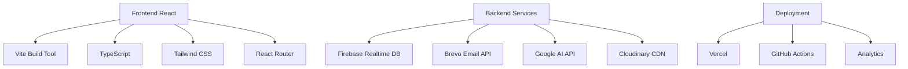

# 🎭 Perfect Models Management

<div align="center">
  
  
  **L'agence de mannequins de référence à Libreville, Gabon**
  
  [](https://perfectmodels.ga)
  [](https://reactjs.org/)
  [](https://www.typescriptlang.org/)
  [](https://vitejs.dev/)
</div>

## 📋 Table des Matières

- [🎯 Vue d'ensemble](#-vue-densemble)
- [✨ Fonctionnalités](#-fonctionnalités)
- [🏗️ Architecture](#️-architecture)
- [🚀 Installation](#-installation)
- [⚙️ Configuration](#️-configuration)
- [📱 Interface Utilisateur](#-interface-utilisateur)
- [🔐 Sécurité](#-sécurité)
- [📊 Analytics & Monitoring](#-analytics--monitoring)
- [🛠️ Développement](#️-développement)
- [📈 Performance](#-performance)
- [🤝 Contribution](#-contribution)

## 🎯 Vue d'ensemble

Perfect Models Management est une plateforme complète de gestion d'agence de mannequins développée avec React, TypeScript et Vite. Elle offre une solution intégrée pour la gestion des talents, des événements, de la comptabilité et de la communication.

### 🎨 Vision
Révolutionner l'industrie du mannequinat en Afrique en offrant une plateforme technologique moderne qui connecte les talents aux opportunités, tout en préservant l'élégance et l'authenticité africaine.

## ✨ Fonctionnalités

### 👥 **Gestion des Mannequins**
- **Profils détaillés** : Photos, mesures, expérience, portfolio
- **Système de niveaux** : Débutants, Professionnels, Étoiles
- **Suivi des paiements** : Cotisations, inscriptions, avances
- **Statuts dynamiques** : À jour, en retard, en attente
- **Galerie photos** : Upload et gestion d'images optimisées

### 💰 **Comptabilité Avancée**
- **Transactions automatiques** : Génération automatique lors des paiements
- **Catégorisation intelligente** : Revenus vs Dépenses avec indicateurs visuels
- **Rapports PDF** : Génération automatique de rapports comptables
- **Bilan en temps réel** : Revenus, dépenses, bénéfice net
- **Périodes personnalisables** : Filtrage par mois/année

### 📧 **Système de Messagerie Unifié**
- **Messagerie interne** : Communication avec les mannequins
- **Campagnes marketing** : Email marketing automatisé
- **Import de contacts** : CSV/TXT avec validation
- **Gestion des contacts** : Base de données centralisée
- **Intégration Brevo** : API email professionnelle

### 🎓 **Formation & Éducation**
- **Modules interactifs** : Cours de mannequinat structurés
- **Progression tracking** : Suivi des avancements
- **Certificats** : Génération automatique de diplômes
- **Contenu multimédia** : Vidéos, images, textes

### 🎪 **Événements & Castings**
- **Fashion Day** : Gestion des événements mode
- **Casting management** : Processus de sélection
- **Jury system** : Évaluation collaborative
- **Résultats automatisés** : Notifications et classements

### 📰 **Contenu & Magazine**
- **Gestion d'articles** : Création et édition de contenu
- **Galerie médias** : Images et vidéos optimisées
- **SEO intégré** : Optimisation pour les moteurs de recherche
- **Publication automatique** : Workflow de validation

### 🎨 **Direction Artistique Optimisée**
- **Briefings avancés** : Création et assignation avec validation robuste
- **Recherche intelligente** : Filtrage par thème, mannequin, lieu, statut
- **Tri dynamique** : Par date, modèle, thème, statut (croissant/décroissant)
- **Interface enrichie** : Cartes avec indicateurs visuels (retard, à venir)
- **Validation en temps réel** : Messages d'erreur clairs et assistance IA
- **Gestion d'état** : Chargement, feedback utilisateur, persistance

### 📊 **Dashboard Analytics Avancé**
- **Métriques en temps réel** : Revenus, mannequins, événements, paiements
- **Graphiques interactifs** : Évolution des performances et tendances
- **Alertes intelligentes** : Paiements en retard, événements à venir
- **Actions rapides** : Accès direct aux fonctionnalités principales
- **Filtres par période** : 7j, 30j, 90j, 1an avec comparaisons
- **Export des données** : Rapports et analyses exportables

### 🔔 **Système de Notifications Unifié**
- **Centre de notifications** : Toutes les alertes en un endroit
- **Filtres par type** : Paiements, événements, mannequins, système, sécurité
- **Recherche avancée** : Trouver rapidement les notifications
- **Gestion des priorités** : Urgent, élevé, moyen, faible avec codes couleur
- **Actions contextuelles** : Marquer comme lu, supprimer, agir
- **Notifications automatiques** : Basées sur les données et événements

## 🏗️ Architecture

### 🎯 **Stack Technologique**



### 📁 **Structure du Projet**

```
src/
├── components/          # Composants réutilisables
│   ├── DashboardCard.tsx
│   ├── InteractiveDashboardCard.tsx
│   └── SEO.tsx
├── contexts/           # Gestion d'état global
│   └── DataContext.tsx
├── hooks/              # Hooks personnalisés
│   └── useAdminNavigation.ts
├── pages/              # Pages de l'application
│   ├── admin/          # Interface administrateur
│   ├── AdminViews.tsx  # Vues centralisées
│   └── ...
├── services/           # Services externes
│   ├── emailService.ts
│   └── contactService.ts
├── types/              # Définitions TypeScript
│   └── types.ts
└── utils/              # Utilitaires
    └── paymentUtils.ts
```

## 🚀 Installation

### 📋 **Prérequis**
- Node.js >= 18.0.0
- npm >= 8.0.0
- Git

### 🔧 **Installation**

```bash
# Cloner le repository
git clone https://github.com/Perfectmodels/Parfait-Louis-Asseko.git
cd Parfait-Louis-Asseko

# Installer les dépendances
npm install

# Configuration des variables d'environnement
cp .env.example .env.local
# Éditer .env.local avec vos clés API

# Lancer en développement
npm run dev

# Build de production
npm run build
```

## ⚙️ Configuration

### 🔑 **Variables d'Environnement**

```env
# Brevo Email API
VITE_BREVO_API_KEY=your-brevo-api-key-here

# Google AI (Gemini) API
VITE_GOOGLE_AI_API_KEY=your-google-ai-api-key-here

# Cloudinary (optionnel)
VITE_CLOUDINARY_CLOUD_NAME=your-cloudinary-cloud-name
VITE_CLOUDINARY_API_KEY=your-cloudinary-api-key
VITE_CLOUDINARY_API_SECRET=your-cloudinary-api-secret

# Firebase (optionnel)
VITE_FIREBASE_API_KEY=your-firebase-api-key
VITE_FIREBASE_AUTH_DOMAIN=your-firebase-auth-domain
VITE_FIREBASE_PROJECT_ID=your-firebase-project-id

# Configuration de l'application
VITE_APP_NAME=Perfect Models
VITE_APP_VERSION=1.0.0
VITE_APP_ENV=production
```

### 🛠️ **Configuration Vercel**

```json
{
  "buildCommand": "npm ci && npm run build",
  "installCommand": "npm ci --legacy-peer-deps",
  "framework": "vite"
}
```

## 📱 Interface Utilisateur

### 🎨 **Design System**

- **Couleurs principales** : 
  - Or (`#D4AF37`) : Élégance et prestige
  - Noir (`#1a1a1a`) : Sophistication
  - Blanc cassé (`#F5F5DC`) : Lisibilité

- **Typographie** :
  - Playfair Display : Titres élégants
  - Montserrat : Texte de corps

- **Composants** :
  - Cards interactives avec animations
  - Formulaires optimisés
  - Navigation intuitive
  - Responsive design

### 📊 **Dashboard Administrateur**

```typescript
// Navigation centralisée
const navigationItems = [
  { id: 'dashboard', label: 'Tableau de Bord', icon: HomeIcon },
  { id: 'mannequins', label: 'Mannequins', icon: UsersIcon },
  { id: 'casting', label: 'Casting & Événements', icon: ClipboardDocumentListIcon },
  { id: 'content', label: 'Contenu', icon: BookOpenIcon },
  { id: 'comptabilite', label: 'Comptabilité', icon: CurrencyDollarIcon },
  { id: 'messagerie', label: 'Messagerie', icon: ChatBubbleLeftRightIcon },
  { id: 'parametres', label: 'Paramètres', icon: Cog6ToothIcon },
  { id: 'technique', label: 'Technique', icon: ServerIcon }
];
```

## 🔐 Sécurité

### 🛡️ **Mesures Implémentées**

- **Variables d'environnement** : Clés API sécurisées
- **Validation des données** : Contrôles côté client et serveur
- **Gestion des erreurs** : Messages d'erreur sécurisés
- **Audit trail** : Traçabilité des actions
- **Headers de sécurité** : Protection XSS, CSRF

### 🔒 **Configuration Sécurisée**

```typescript
// Headers de sécurité dans vercel.json
{
  "headers": [
    {
      "source": "/(.*)",
      "headers": [
        { "key": "X-Frame-Options", "value": "SAMEORIGIN" },
        { "key": "X-Content-Type-Options", "value": "nosniff" },
        { "key": "Referrer-Policy", "value": "origin-when-cross-origin" },
        { "key": "Strict-Transport-Security", "value": "max-age=63072000; includeSubDomains; preload" }
      ]
    }
  ]
}
```

## 📊 Analytics & Monitoring

### 📈 **Intégrations Analytics**

- **Vercel Analytics** : Métriques de performance
- **Google Analytics** : Suivi des utilisateurs
- **Speed Insights** : Optimisation des performances
- **Error Tracking** : Monitoring des erreurs

### 📊 **Métriques Clés**

- **Performance** : Core Web Vitals optimisés
- **Utilisabilité** : Taux de conversion
- **Technique** : Temps de réponse, erreurs
- **Business** : Revenus, utilisateurs actifs

## 🛠️ Développement

### 🔧 **Scripts Disponibles**

```bash
# Développement
npm run dev          # Serveur de développement
npm run build        # Build de production
npm run preview      # Aperçu du build

# Qualité du code
npm run lint         # Vérification ESLint
npm run type-check   # Vérification TypeScript
```

### 🧪 **Tests**

```bash
# Tests unitaires
npm run test

# Tests d'intégration
npm run test:integration

# Couverture de code
npm run test:coverage
```

### 📦 **Dépendances Principales**

```json
{
  "dependencies": {
    "@google/genai": "^1.17.0",
    "@heroicons/react": "^2.1.3",
    "firebase": "^12.2.1",
    "framer-motion": "^12.23.13",
    "react": "18.3.1",
    "react-dom": "18.3.1",
    "react-router-dom": "^6.30.1"
  },
  "devDependencies": {
    "@types/react": "^18.2.66",
    "@vitejs/plugin-react": "^4.2.1",
    "tailwindcss": "^3.4.3",
    "typescript": "^5.2.2",
    "vite": "^6.0.1"
  }
}
```

## 📈 Performance

### ⚡ **Optimisations Implémentées**

- **Code Splitting** : Chargement à la demande
- **Lazy Loading** : Composants et images
- **Bundle Optimization** : Chunks optimisés
- **Caching Strategy** : Cache intelligent
- **Image Optimization** : Compression automatique

### 📊 **Métriques de Performance**

- **First Contentful Paint** : < 1.5s
- **Largest Contentful Paint** : < 2.5s
- **Cumulative Layout Shift** : < 0.1
- **Time to Interactive** : < 3.0s

### 🚀 **Optimisations Futures**

- **Service Workers** : Cache offline
- **WebP Images** : Format moderne
- **Tree Shaking** : Élimination du code mort
- **Preloading** : Ressources critiques

## 🤝 Contribution

### 📋 **Processus de Contribution**

1. **Fork** le repository
2. **Créer** une branche feature (`git checkout -b feature/AmazingFeature`)
3. **Commit** les changements (`git commit -m 'Add some AmazingFeature'`)
4. **Push** vers la branche (`git push origin feature/AmazingFeature`)
5. **Ouvrir** une Pull Request

### 🎯 **Standards de Code**

- **TypeScript** : Typage strict
- **ESLint** : Règles de code
- **Prettier** : Formatage automatique
- **Conventional Commits** : Messages standardisés

### 📝 **Documentation**

- **JSDoc** : Documentation des fonctions
- **README** : Guide d'utilisation
- **CHANGELOG** : Historique des versions
- **API Docs** : Documentation des APIs

## 🚀 Roadmap

### 🎯 **Version 2.0 (Q2 2024)**

- [ ] **Mobile App** : Application native
- [ ] **AI Integration** : Assistant IA avancé
- [ ] **Blockchain** : Contrats intelligents
- [ ] **VR/AR** : Expériences immersives

### 🌟 **Fonctionnalités Futures**

- [ ] **Multi-langue** : Support international
- [ ] **API Public** : Écosystème développeurs
- [ ] **Marketplace** : Plateforme de services
- [ ] **IoT Integration** : Capteurs intelligents

## 📞 Support

### 🆘 **Aide & Support**

- **Documentation** : [docs.perfectmodels.ga](https://docs.perfectmodels.ga)
- **Support Email** : support@perfectmodels.ga
- **Issues GitHub** : [GitHub Issues](https://github.com/Perfectmodels/Parfait-Louis-Asseko/issues)
- **Discord** : [Communauté Discord](https://discord.gg/perfectmodels)

### 📧 **Contact**

- **Site Web** : [perfectmodels.ga](https://perfectmodels.ga)
- **Email** : contact@perfectmodels.ga
- **LinkedIn** : [Perfect Models](https://linkedin.com/company/perfect-models)
- **Instagram** : [@perfectmodels.ga](https://instagram.com/perfectmodels.ga)

---

<div align="center">
  <p>Fait avec ❤️ par l'équipe Perfect Models</p>
  <p>© 2024 Perfect Models Management. Tous droits réservés.</p>
</div>