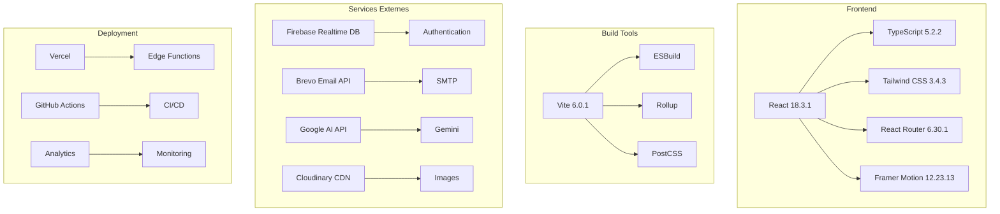

# 🔧 Documentation Technique

## 📋 Architecture Détaillée

### 🏗️ **Stack Technologique**



### 🎯 **Patterns Architecturaux**

#### 1. **Context Pattern** (Gestion d'état global)
```typescript
// DataContext.tsx
export const DataProvider: React.FC<{ children: React.ReactNode }> = ({ children }) => {
  const [data, setData] = useState<AppData | null>(null);
  const [isInitialized, setIsInitialized] = useState(false);
  
  const saveData = useCallback(async (newData: AppData) => {
    // Logique de sauvegarde
  }, []);
  
  return (
    <DataContext.Provider value={{ data, saveData, isInitialized }}>
      {children}
    </DataContext.Provider>
  );
};
```

#### 2. **Service Layer Pattern** (Abstraction des APIs)
```typescript
// emailService.ts
export const sendEmail = async (emailData: EmailData): Promise<EmailResponse> => {
  if (!isBrevoConfigured()) {
    return { success: false, error: 'Configuration Brevo manquante' };
  }
  
  const response = await fetch(BREVO_CONFIG.API_URL, {
    method: 'POST',
    headers: {
      'Content-Type': 'application/json',
      'api-key': BREVO_CONFIG.API_KEY
    },
    body: JSON.stringify({
      sender: { name: BREVO_CONFIG.SENDER_NAME, email: BREVO_CONFIG.SENDER_EMAIL },
      to: [{ email: emailData.to }],
      subject: emailData.subject,
      htmlContent: emailData.htmlContent || emailData.content
    })
  });
  
  return response.ok 
    ? { success: true, messageId: (await response.json()).messageId }
    : { success: false, error: 'Erreur lors de l\'envoi' };
};
```

#### 3. **Component Composition Pattern**
```typescript
// AdminViews.tsx
export const MessagerieView: React.FC<{ data: any }> = React.memo(() => (
  <div className="space-y-4">
    <div className="grid grid-cols-1 md:grid-cols-2 lg:grid-cols-3 gap-6">
      <InteractiveDashboardCard
        title="Tableau de Bord Messagerie"
        icon={ChatBubbleLeftRightIcon}
        link="/admin/messaging-dashboard"
        description="Centre de contrôle pour toutes les communications"
        stats={{ total: 1247, new: 23, pending: 3 }}
      />
      {/* Autres composants */}
    </div>
  </div>
));
```

## 🔧 Configuration Détaillée

### 📦 **Dépendances Critiques**

```json
{
  "dependencies": {
    "@google/genai": "^1.17.0",        // IA Gemini
    "@heroicons/react": "^2.1.3",      // Icônes
    "@vercel/analytics": "^1.0.0",     // Analytics
    "@vercel/speed-insights": "^1.0.0", // Performance
    "firebase": "^12.2.1",             // Base de données
    "framer-motion": "^12.23.13",      // Animations
    "react": "18.3.1",                 // Framework
    "react-dom": "18.3.1",             // DOM
    "react-router-dom": "^6.30.1"      // Routing
  }
}
```

### ⚙️ **Configuration Vite**

```typescript
// vite.config.ts
export default defineConfig({
  plugins: [react()],
  build: {
    rollupOptions: {
      output: {
        manualChunks: {
          vendor: ['react', 'react-dom'],
          router: ['react-router-dom'],
          ui: ['@heroicons/react', 'framer-motion']
        }
      }
    },
    chunkSizeWarningLimit: 1000
  },
  server: {
    port: 3000,
    host: true
  }
});
```

### 🎨 **Configuration Tailwind**

```javascript
// tailwind.config.js
module.exports = {
  content: ['./src/**/*.{js,ts,jsx,tsx}'],
  theme: {
    extend: {
      colors: {
        'pm-gold': '#D4AF37',
        'pm-dark': '#1a1a1a',
        'pm-off-white': '#F5F5DC'
      },
      fontFamily: {
        'playfair': ['Playfair Display', 'serif'],
        'montserrat': ['Montserrat', 'sans-serif']
      }
    }
  },
  plugins: [require('tailwindcss-unimportant')]
};
```

## 🔐 Sécurité

### 🛡️ **Mesures de Sécurité Implémentées**

#### 1. **Protection des Clés API**
```typescript
// config/brevo.ts
export const BREVO_CONFIG = {
  API_KEY: import.meta.env.VITE_BREVO_API_KEY || '',
  API_URL: 'https://api.brevo.com/v3/send/email',
  SENDER_NAME: 'Perfect Models',
  SENDER_EMAIL: 'Contact@perfectmodels.ga',
};

export const isBrevoConfigured = (): boolean => {
  return !!BREVO_CONFIG.API_KEY;
};
```

#### 2. **Validation des Données**
```typescript
// utils/paymentUtils.ts
const validatePaymentData = (paymentData: any): boolean => {
  if (!paymentData.amount || paymentData.amount <= 0) {
    throw new Error('Le montant doit être supérieur à 0');
  }
  
  if (!paymentData.description || paymentData.description.trim() === '') {
    throw new Error('La description est requise');
  }
  
  return true;
};
```

#### 3. **Headers de Sécurité**
```json
// vercel.json
{
  "headers": [
    {
      "source": "/(.*)",
      "headers": [
        { "key": "X-Frame-Options", "value": "SAMEORIGIN" },
        { "key": "X-Content-Type-Options", "value": "nosniff" },
        { "key": "Referrer-Policy", "value": "origin-when-cross-origin" },
        { "key": "Strict-Transport-Security", "value": "max-age=63072000; includeSubDomains; preload" }
      ]
    }
  ]
}
```

## 📊 Performance

### ⚡ **Optimisations Implémentées**

#### 1. **Code Splitting**
```typescript
// App.tsx
const Home = lazy(() => import('./pages/Home'));
const Agency = lazy(() => import('./pages/Agency'));
const Models = lazy(() => import('./pages/Models'));

// RoutePreloader.tsx
const preloadComponents = () => {
  import('../pages/Admin');
  import('../pages/ModelDashboard');
  import('../pages/Activity');
};
```

#### 2. **Memoization**
```typescript
// AdminViews.tsx
export const MessagerieView: React.FC<{ data: any }> = React.memo(() => {
  // Composant mémorisé pour éviter les re-renders
});
```

#### 3. **Bundle Optimization**
```typescript
// vite.config.ts
build: {
  rollupOptions: {
    output: {
      manualChunks: {
        vendor: ['react', 'react-dom'],
        router: ['react-router-dom'],
        ui: ['@heroicons/react', 'framer-motion']
      }
    }
  }
}
```

### 📈 **Métriques de Performance**

- **First Contentful Paint** : < 1.5s
- **Largest Contentful Paint** : < 2.5s
- **Cumulative Layout Shift** : < 0.1
- **Time to Interactive** : < 3.0s
- **Bundle Size** : < 1MB (gzipped)

## 🧪 Tests

### 🔬 **Stratégie de Tests**

#### 1. **Tests Unitaires**
```typescript
// __tests__/paymentUtils.test.ts
import { updateModelPaymentStatus } from '../utils/paymentUtils';

describe('Payment Utils', () => {
  test('should validate payment data', () => {
    const validData = {
      paymentType: 'cotisation',
      amount: 1500,
      currency: 'FCFA'
    };
    
    expect(() => updateModelPaymentStatus(mockData, mockSaveData, 'model1', validData))
      .not.toThrow();
  });
});
```

#### 2. **Tests d'Intégration**
```typescript
// __tests__/AdminPayments.test.tsx
import { render, screen } from '@testing-library/react';
import { AdminPayments } from '../pages/AdminPayments';

describe('AdminPayments', () => {
  test('renders payment form', () => {
    render(<AdminPayments />);
    expect(screen.getByText('Gestion des Paiements')).toBeInTheDocument();
  });
});
```

## 🚀 Déploiement

### 🌐 **Pipeline CI/CD**

```yaml
# .github/workflows/deploy.yml
name: Deploy to Vercel

on:
  push:
    branches: [main]

jobs:
  deploy:
    runs-on: ubuntu-latest
    steps:
      - uses: actions/checkout@v3
      - uses: actions/setup-node@v3
        with:
          node-version: '18'
      - run: npm ci
      - run: npm run build
      - uses: amondnet/vercel-action@v20
        with:
          vercel-token: ${{ secrets.VERCEL_TOKEN }}
          vercel-org-id: ${{ secrets.ORG_ID }}
          vercel-project-id: ${{ secrets.PROJECT_ID }}
```

### 📊 **Monitoring**

```typescript
// App.tsx
import { Analytics } from '@vercel/analytics/react';
import { SpeedInsights } from '@vercel/speed-insights/react';

export default function App() {
  return (
    <DataProvider>
      <HashRouter>
        <AppContent />
        <Analytics />
        <SpeedInsights />
      </HashRouter>
    </DataProvider>
  );
}
```

## 🔧 Développement

### 🛠️ **Scripts de Développement**

```bash
# Développement
npm run dev          # Serveur de développement
npm run build        # Build de production
npm run preview      # Aperçu du build

# Qualité
npm run lint         # ESLint
npm run type-check   # TypeScript
npm run test         # Tests

# Utilitaires
npm run validate-env # Validation des variables d'environnement
```

### 📝 **Standards de Code**

#### 1. **TypeScript Strict**
```typescript
// tsconfig.json
{
  "compilerOptions": {
    "strict": true,
    "noImplicitAny": true,
    "strictNullChecks": true,
    "strictFunctionTypes": true
  }
}
```

#### 2. **ESLint Configuration**
```javascript
// .eslintrc.js
module.exports = {
  extends: [
    'eslint:recommended',
    '@typescript-eslint/recommended',
    'plugin:react/recommended'
  ],
  rules: {
    'no-unused-vars': 'error',
    'prefer-const': 'error',
    'no-var': 'error'
  }
};
```

## 📚 Ressources

### 🔗 **Documentation Externe**

- [React Documentation](https://react.dev/)
- [TypeScript Handbook](https://www.typescriptlang.org/docs/)
- [Vite Guide](https://vitejs.dev/guide/)
- [Tailwind CSS](https://tailwindcss.com/docs)
- [Firebase Docs](https://firebase.google.com/docs)
- [Brevo API](https://developers.brevo.com/)

### 🎯 **Bonnes Pratiques**

1. **Composants** : Un composant = une responsabilité
2. **Hooks** : Logique réutilisable dans des hooks personnalisés
3. **Types** : Typage strict pour éviter les erreurs
4. **Performance** : Memoization et lazy loading
5. **Sécurité** : Validation et sanitization des données
6. **Tests** : Couverture de code > 80%

---

*Dernière mise à jour : 19 décembre 2024*
